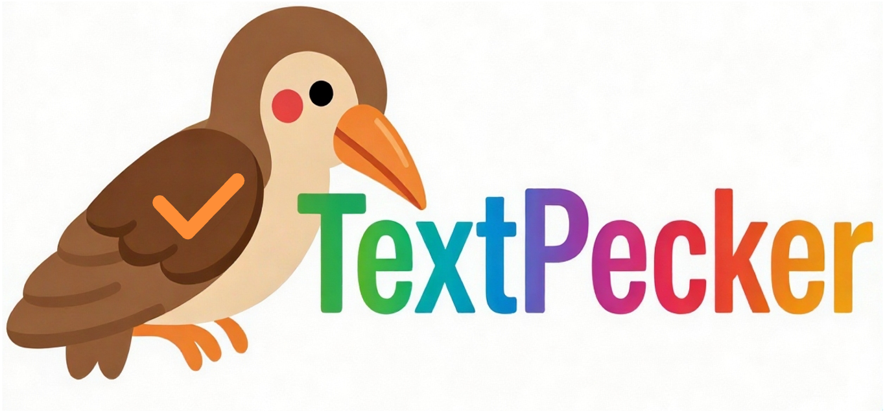
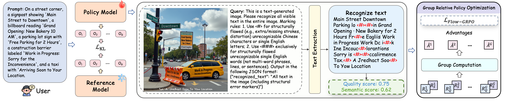

<p align="center">
  
</p>

<p align="center">
  <a href="https://github.com/CIawevy/TextPecker">
    
  </a>
  <a href="https://arxiv.org/abs/2505.14683">
    
  </a>
  <a href="https://huggingface.co/CIawevy/TextPecker-8B-InternVL3">
    
  </a>
  <a href="https://github.com/CIawevy/TextPecker/blob/main/eval/TextPecker_eval/demo.py">
    
  </a>
   <a href="https://huggingface.co/datasets/CIawevy/TextPecker-1.5M">
    
  </a>
  <!-- <a href="https://huggingface.co/spaces/ByteDance/TextPecker">
    
  </a> -->
  <!-- <a href="https://discord.gg/eXQNFhWe">
    
  </a> -->
  <!-- <a href="mailto:TextPecker@bytedance.com">
    
  </a>
</p> -->

# TextPecker: Rewarding Structural Anomaly Quantification for Enhancing Visual Text Rendering

> [Hanshen Zhu](https://scholar.google.com/citations?user=1tjNZlcAAAAJ&hl=en), [Yuliang Liu](https://scholar.google.com/citations?user=9uPDtI4AAAAJ&hl=zh-CN&authuser=1), [Xuecheng Wu](https://scholar.google.com/citations?user=MuTEp7sAAAAJ&hl=zh-CN), [An-Lan Wang](https://scholar.google.com/citations?user=mazWHncAAAAJ&hl=en), [Hao Feng](https://scholar.google.com/citations?user=aB8DspEAAAAJ&hl=zh-CN), [Dingkang Yang](https://scholar.google.com/citations?user=jvlDhkcAAAAJ&hl=zh-CN), [Chao Feng](https://scholar.google.com/citations?hl=en&view_op=list_works&gmla=AIfU4H7WFVeWuU5GeELC6VB1oKluoC7ZQlQxUCGcDWqHhdX2iIfDMrfcw1Jjj3dUejmTU2gS8q8ey1quzooAZ0VLTTBW4O5iVcfeqpf_7HU&user=4eEryIsAAAAJ), [Can Huang](https://scholar.google.com/citations?user=ON9Rx-IAAAAJ&hl=zh-CN), [Jingqun Tang](https://scholar.google.com/citations?user=OxQXSioAAAAJ&hl=zh-CN)<sup>†</sup>, [Xiang Bai](https://scholar.google.com/citations?user=UeltiQ4AAAAJ&hl=en)<sup>†</sup>
> ## Abstract
>Visual Text Rendering (VTR) remains a critical challenge in text‑to‑image generation, where even advanced models frequently produce text with structural anomalies such as distortion, blurriness, and misalignment.
However, we find that leading MLLMs and specialist OCR models largely fail to perceive these structural anomalies, creating a critical bottleneck for both VTR evaluation and RL‑based optimization.   
As a result, even state‑of‑the‑art generators (e.g., SeedDream4.0, Qwen‑Image) still struggle to render structurally faithful text.
To address this, we propose **TextPecker**,
a plug-and-play structural anomaly perceptive RL strategy that mitigates noisy reward signals and works with any text-to-image generator. 
To enable this capability, we construct a recognition dataset with character‑level structural‑anomaly annotations and develop a stroke‑editing synthesis engine to expand structural‑error coverage. 
Experiments show that TextPecker consistently improves diverse text‑to‑image models; even on the well‑optimized Qwen‑Image, it significantly yields average gains of 4% in structural fidelity and 8.7% in semantic alignment for Chinese text rendering, establishing a new state-of-the-art in high-fidelity VTR.
Our work fills a gap in VTR optimization, providing a foundational step towards  reliable and structural faithful visual text generation.

<p align="center"></p>
<!-- <p align="center"></p> -->
<!-- <p align="center"></p> -->
<!-- <p align="center"></p> -->

[//]: # (This repository represents the official implementation of the paper titled "TextPecker: Rewarding Structural Anomaly Quantification for Enhancing Visual Text Rendering".)

## 📢 News
<!-- - **Feb 22, 2026:** We released optimized model checkpoints: [Qwen Image](), [SD3.5-M](), and [Flux.1-[dev]]().
- **Feb 20, 2026:** Our Arxiv Paper is now publicly available.
- **Feb 20, 2026:**  TextPecker has been accepted to **CVPR 2026**. -->
- **Feb 15, 2026:** We released the official [website](https://github.com/CIawevy/TextPecker),[model](https://huggingface.co/CIawevy/TextPecker-8B-InternVL3), [dataset](https://huggingface.co/datasets/CIawevy/TextPecker-1.5M) for TextPecker.


## 🔥 Quick Start

Training, deployment, and evaluation of TextPecker are all built upon [ms-swift](https://github.com/modelscope/ms-swift). We currently provide two versions of model checkpoints: [TextPecker-8B-Qwen3VL](https://huggingface.co/CIawevy/TextPecker-8B-Qwen3VL) and [TextPecker-8B-InternVL3](https://huggingface.co/CIawevy/TextPecker-8B-InternVL3). For detailed environment setup and model deployment/testing instructions, please refer to the [official documentation](https://swift.readthedocs.io/en/latest/index.html). 

1️⃣ Environment Setup
```bash
git clone https://github.com/CIawevy/TextPecker.git
cd TextPecker/train
git clone https://github.com/modelscope/ms-swift.git
cd ms-swift
conda create -n TextPecker python=3.11.13 -y
conda activate TextPecker
pip install -e .
cd ..
sh install_all.sh
```

2️⃣ Download Models & Dataset

We have uploaded our models and datasets to Hugging Face. You can download them using the provided scripts. Modify parameters (e.g., local paths, HF token) in `scripts/download_models.sh` and `scripts/download_dataset.sh` as needed, then run `bash scripts/download_xxx.sh` (for models / datasets). Additionally, refer to [DATA](https://github.com/CIawevy/TextPecker_engine) to use our data engine for synthesizing your own datasets if needed.

3️⃣ Deployment （See [TRAIN](train/README.md) for more details.）

Example

```bash
bash train/deploy_textpecker.sh
```
4️⃣ Demo

After deployment, you can run the following command to try our demo:
```bash
python eval/TextPecker_eval/demo.py
```


## 🔥 Train & Eval

### TextPecker training

TextPecker training, deployment, and evaluation are built on top of [ms-swift](https://github.com/modelscope/ms-swift). We provide backbone-specific training scripts under `train` folder. See [TRAIN](train/README.md) for more details.

  
### VTR RL Training (TextPecker Reward)

Our RL framework builds on [Flow-GRPO](https://github.com/yifan123/flow_grpo). We provide training code for optimizing text rendering models with TextPecker under `./RL/flow_grpo/`. For details, please refer to [RL](RL/README.md).


### Re-evaluate Benchmarks with TextPecker

TextPecker can evaluate text structural quality and image-level or box-level semantic consistency for any text generation or editing scenarios. We provide re-evaluation instructions for the following benchmarks: OneIG-Bench, CVTG-2K, LongText, TextAtlas, LeX-Bench, and TIIF-Bench. For more details, see [EVAL](eval/README.md).


<!-- ## 📊 Benchmarks

### 1. Visual Understanding

| Model | MME | MMBench |   MMMU | MM-Vet | MathVista |
| ------------------- | ----------: | ----------: | -------: | -------: | ----------: |
| Janus-Pro-7B        | -  |     79.2 |     41.0 |     50.0 |           – |
| Qwen2.5-VL-7B      | 2347    |   83.5 | **58.6** |     67.1 |           68.2 |
| **TextPecker**    | **2388**  |  **85.0** |     55.3 | **67.2** |    **73.1** |

### 2. Text-to-Image Generation

| Model        | GenEval | WISE |
| ------------ | --------- | --------- |
| Janus-Pro-7B | 0.80      | 0.35 | 
| SD3-Medium   | 0.74      | - |
| FLUX-1-dev   | 0.82      | 0.50 |
| **TextPecker**    | 0.82  | 0.52  |
| **TextPecker + Rewritter/CoT**    | **0.88**  | **0.70** |

### 3. Image Editing

| Model         | GEdit-Bench-EN (SC) | GEdit-Bench-EN (PQ) | GEdit-Bench-EN (O) | IntelligentBench | KISE-Bench | RISEBench |
| ------------- | ---------------------: | ---------------------: | -------------------: | ------------------: | ------------: | ------------: | 
| Step1X-Edit   | 🥉7.09                | 🥉6.76                | 🥈6.70            | 14.9               |  43.29   |  1.9  |
| Gemini 2.0    | 6.73                  | 6.61                  | 6.32                | 🥈57.6             | 🥈62.41   |  🥈13.3  |
| GPT-4o        | 🥇7.85              | 🥇7.62              | 🥇7.53            | 🥇78.9           | 🥇80.09   |  🥇28.9  |
| **TextPecker**     | 🥈7.36                | 🥈6.83                | 🥉6.52                | 44.0               |  56.21   |  6.1 |
| **TextPecker+CoT** | –                     | –                     | –                   | 🥉55.3             |  🥉60.18   |  🥉11.9 |
 -->


# Acknowledgement
We sincerely thank 
[ms-swift](https://github.com/modelscope/ms-swift#), 
[Flow-GRPO](https://github.com/yifan123/flow_grpo) 
for their valuable methodological contributions.

Additionally, we appreciate the support of 
[TextAtlas5M](https://github.com/CSU-JPG/TextAtlas), 
[LeX-10k](https://github.com/zhaoshitian/LeX-Art), 
[SynTIGER](https://github.com/clovaai/synthtiger),
[WanJuan1.0](https://github.com/opendatalab/WanJuan1.0), 
[Flux.1-dev](https://huggingface.co/black-forest-labs/FLUX.1-dev),
[Qwen-Image](https://huggingface.co/Qwen/Qwen-Image), 
[SD3.5](https://huggingface.co/stabilityai/stable-diffusion-3.5-medium), 
[CogView4](https://github.com/zai-org/CogView4), 
[Kolors](https://github.com/Kwai-Kolors/Kolors) and 
[Seedream4.0](https://seed.bytedance.com/en/seedream4_0)
for their role in data generation. 

We also thank the evaluation benchmarks including 
[CVTG-2K](https://github.com/NJU-PCALab/TextCrafter), 
[LongText](https://github.com/X-Omni-Team/X-Omni), 
[OneIG-Bench](https://github.com/OneIG-Bench/OneIG-Benchmark), 
[TIIF-Bench](https://github.com/A113N-W3I/TIIF-Bench), 
[TextAtlas](https://github.com/CSU-JPG/TextAtlas) and 
[LeX-Bench](https://github.com/zhaoshitian/LeX-Art) for facilitating text rendering evaluation.

## ✍️ Citation
If you find TextPecker useful in your research or work, please cite our paper:
```bibtex
@article{zhu2026TextPecker,
  title   = {TextPecker: Rewarding Structural Anomaly Quantification for Enhancing Visual Text Rendering},
  author  = {Zhu, Hanshen and Liu, Yuliang and Wu, Xuecheng and Wang, An-Lan and Feng, Hao and Yang, Dingkang and Feng, Chao and Huang, Can and Tang, Jingqun and Bai, Xiang},
  journal = {arXiv preprint arXiv:},
  year    = {2026}
}
```


## 📜 License
TextPecker is licensed under the Apache 2.0.